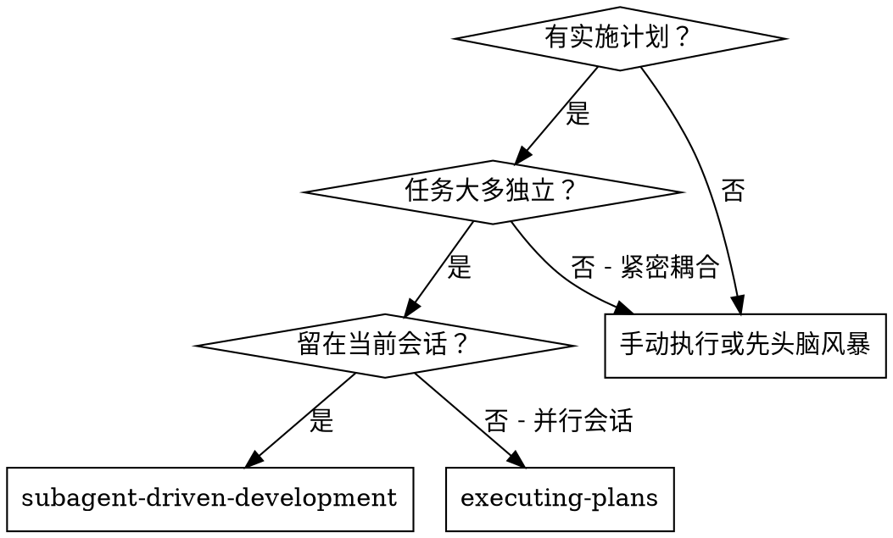
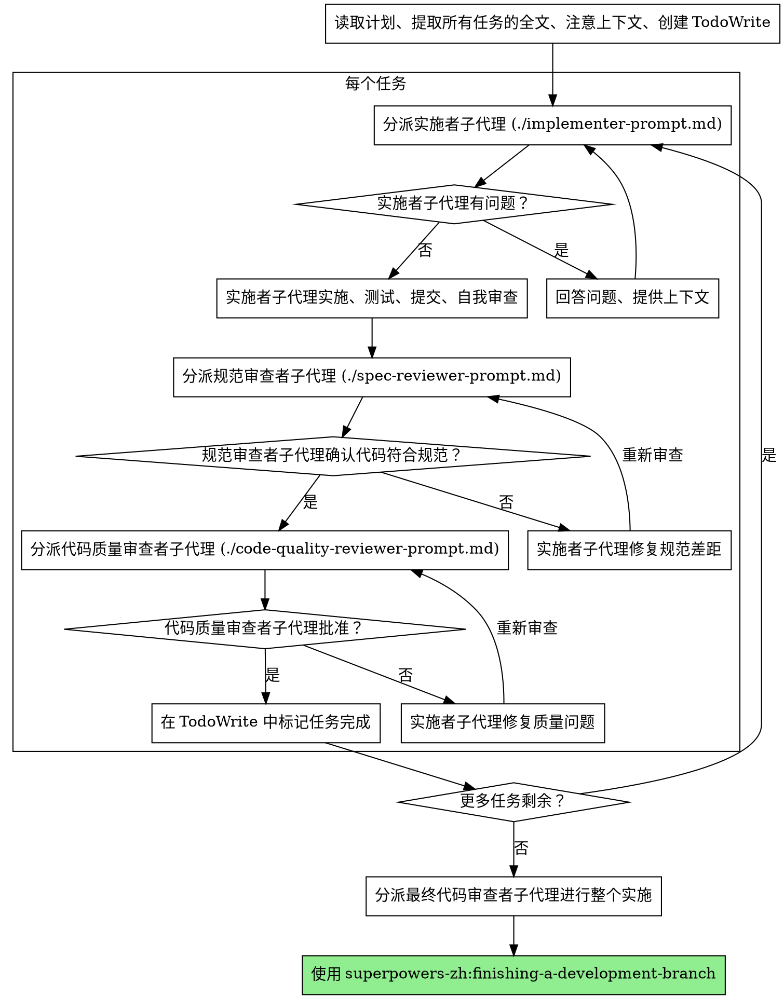

# 子代理驱动开发

通过为每个任务分派新的子代理来执行计划，每个任务后进行两阶段审查：首先是规范合规审查，然后是代码质量审查。

**核心原则：** 每个任务使用新子代理 + 两阶段审查（先规范后质量）= 高质量、快速迭代

## 何时使用



**与执行计划（并行会话）相比：**
- 同一会话（无上下文切换）
- 每个任务使用新子代理（无上下文污染）
- 每个任务后两阶段审查：先规范合规，然后代码质量
- 更快迭代（任务之间无需人工介入）

## 流程



## 提示词模板

- `./implementer-prompt.md` - 分派实施者子代理
- `./spec-reviewer-prompt.md` - 分派规范合规审查者子代理
- `./code-quality-reviewer-prompt.md` - 分派代码质量审查者子代理

## 示例工作流

```
你：我正在使用子代理驱动开发执行此计划。

[读取计划文件一次：docs/plans/feature-plan.md]
[提取所有 5 个任务的全文和上下文]
[使用所有任务创建 TodoWrite]

任务 1：Hook 安装脚本

[获取任务 1 文本和上下文（已提取）]
[分派实施子代理，提供完整任务文本 + 上下文]

实施者："开始之前 - hook 应该安装在用户级别还是系统级别？"

你："用户级别 (~/.config/superpowers/hooks/)"

实施者："明白了。现在实施..."
[稍后] 实施者：
  - 实施了 install-hook 命令
  - 添加了测试，5/5 通过
  - 自我审查：发现我错过了 --force 标志，已添加
  - 已提交

[分派规范合规审查者]
规范审查者：✅ 符合规范 - 满足所有要求，没有额外内容

[获取 git SHA，分派代码质量审查者]
代码审查者：优点：良好的测试覆盖率，干净。问题：无。批准。

[标记任务 1 完成]

任务 2：恢复模式

[获取任务 2 文本和上下文（已提取）]
[分派实施子代理，提供完整任务文本 + 上下文]

实施者：[无问题，继续]
实施者：
  - 添加了 verify/repair 模式
  - 8/8 测试通过
  - 自我审查：都很好
  - 已提交

[分派规范合规审查者]
规范审查者：❌ 问题：
  - 缺失：进度报告（规范说"每 100 项报告一次"）
  - 额外：添加了 --json 标志（未请求）

[实施者修复问题]
实施者：删除了 --json 标志，添加了进度报告

[规范审查者再次审查]
规范审查者：✅ 现在符合规范

[分派代码质量审查者]
代码审查者：优点：扎实。问题（重要）：魔法数字（100）

[实施者修复]
实施者：提取了 PROGRESS_INTERVAL 常量

[代码审查者再次审查]
代码审查者：✅ 批准

[标记任务 2 完成]

...

[所有任务后]
[分派最终代码审查者]
最终审查者：满足所有要求，准备合并

完成！
```

## 优势

**与手动执行相比：**
- 子代理自然遵循 TDD
- 每个任务新上下文（无混乱）
- 并行安全（子代理不干扰）
- 子代理可以提问（工作之前和期间）

**与执行计划相比：**
- 同一会话（无移交）
- 连续进展（无等待）
- 审查检查点自动

**效率增益：**
- 无文件读取开销（控制器提供全文）
- 控制器准确策展所需上下文
- 子代理预先获得完整信息
- 问题在工作开始前浮现（不是之后）

**质量关卡：**
- 自我审查在移交前捕获问题
- 两阶段审查：规范合规，然后代码质量
- 审查循环确保修复真正有效
- 规范合规防止过度/过度构建
- 代码质量确保实施良好

**成本：**
- 更多子代理调用（每个任务实施者 + 2 个审查者）
- 控制器做更多准备工作（预先提取所有任务）
- 审查循环添加迭代
- 但早期捕获问题（比之后调试更便宜）

## 危险信号

**永远不要：**
- 跳过审查（规范合规或代码质量）
- 在未修复问题的情况下继续
- 并行分派多个实施子代理（冲突）
- 让子代理读取计划文件（改为提供全文）
- 跳过场景设置上下文（子代理需要了解任务适合的位置）
- 忽略子代理问题（在让它们继续之前回答）
- 接受规范合规的"足够接近"（规范审查者发现问题 = 未完成）
- 跳过审查循环（审查者发现问题 = 实施者修复 = 再次审查）
- 让实施者自我审查替代实际审查（两者都需要）
- **在规范合规 ✅ 之前开始代码质量审查**（错误顺序）
- 在任一审查有未决问题时移动到下一个任务

**如果子代理提问：**
- 清楚完整地回答
- 如需提供额外上下文
- 不要催促它们进入实施

**如果审查者发现问题：**
- 实施者（同一子代理）修复它们
- 审查者再次审查
- 重复直到批准
- 不要跳过重新审查

**如果子代理任务失败：**
- 分派修复子代理，提供具体指令
- 不要尝试手动修复（上下文污染）

## 集成

**必需的工作流技能：**
- **superpowers-zh:writing-plans** - 创建此技能执行的计划
- **superpowers-zh:requesting-code-review** - 审查者子代理的代码审查模板
- **superpowers-zh:finishing-a-development-branch** - 所有任务后完成开发

**子代理应该使用：**
- **superpowers-zh:test-driven-development** - 子代理为每个任务遵循 TDD

**替代工作流：**
- **superpowers-zh:executing-plans** - 用于并行会话而不是同会话执行
