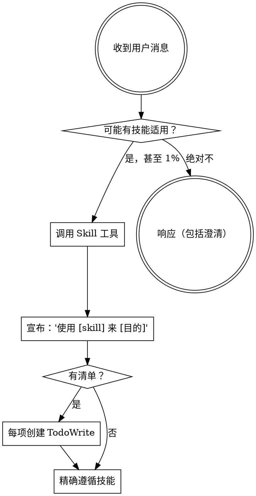

<极其重要>
如果你认为甚至只有 1% 的机会某个技能可能适用于你正在做的事情，你绝对必须调用该技能。

如果技能适用于你的任务，你别无选择。你必须使用它。

这不是可商量的。这不是可选的。你不能合理化自己摆脱这个。
</极其重要>

## 如何访问技能

**在 Claude Code 中：** 使用 `Skill` 工具。当你调用技能时，其内容被加载并呈现给你——直接遵循它。永远不要在技能文件上使用 Read 工具。

**在其他环境中：** 查看你平台的文档以了解如何加载技能。

# 使用技能

## 规则

**在任何响应或行动之前调用相关或请求的技能。** 甚至只有 1% 的机会技能可能适用意味着你应该调用技能来检查。如果调用的技能结果对情况不适用，你不需要使用它。

## 危险信号

这些想法意味着停止——你在合理化：

| 想法 | 现实 |
|---------|---------|
| "这只是一个简单问题" | 问题是任务。检查技能。 |
| "我需要更多上下文" | 技能检查在澄清问题之前。 |
| "让我先探索代码库" | 技能告诉你如何探索。先检查。 |
| "我可以快速检查 git/文件" | 文件缺少对话上下文。检查技能。 |
| "让我先收集信息" | 技能告诉你如何收集信息。 |
| "这不需要正式技能" | 如果技能存在，使用它。 |
| "我记得这个技能" | 技能会演进。阅读当前版本。 |
| "这不算任务" | 行动 = 任务。检查技能。 |
| "技能过度了" | 简单的事情会变复杂。使用它。 |
| "我就先做这一件事" | 在做任何事之前检查。 |
| "这感觉很有生产力" | 无纪律的行动浪费时间。技能防止这种情况。 |
| "我知道这意味着什么" | 知道概念 ≠ 使用技能。调用它。 |

## 技能优先级

当多个技能可能适用时，使用此顺序：

1. **过程技能优先**（brainstorming、debugging）- 这些确定如何处理任务
2. **实施技能其次**（frontend-design、mcp-builder）- 这些指导执行

"让我们构建 X" → 先头脑风暴，然后实施技能。
"修复这个 bug" → 先调试，然后领域特定技能。

## 技能类型

**刚性**（TDD、调试）：精确遵循。不要适应掉纪律。

**灵活**（模式）：适应上下文的原则。

技能本身会告诉你哪种。

## 用户指令

指令说明什么，不说明如何。"添加 X"或"修复 Y"并不意味着跳过工作流。
